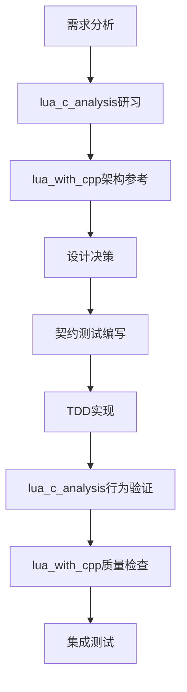
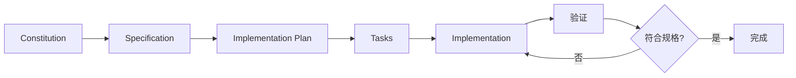

# 现代C++版Lua 5.1.5解释器

<div align="center">
    <h3><em>基于Specification-Driven Development构建的企业级Lua解释器</em></h3>
</div>

<p align="center">
    <strong>一个完全兼容Lua 5.1.5的现代C++实现，采用规格驱动开发方法论确保高质量和可维护性</strong>
</p>

[](https://github.com/YanqingXu/lua_cpp/actions)
[](https://opensource.org/licenses/MIT)
[](https://en.cppreference.com/w/cpp)

## 🤖 **New AI Sessions - Quick Context Setup**

为新的AI对话快速建立项目上下文：
- **📖 完整项目上下文**: 阅读 `./AGENTS.md` - 2分钟理解项目全貌
- **🚀 快速启动指南**: 查看 `./CONTEXT_SETUP.md` - AI助手使用说明  
- **⚡ Spec-Kit集成**: 支持 `/clarify` `/analyze` `/implement` 命令
- **📊 当前进度**: 26/58任务完成 (44.8%)，T026 高级调用栈管理完成

## 🚀 最新进展 (2025-09-26)

### 🌟 T026高级调用栈管理完成！
- ✅ **完整VM系统实现** (T025-T026完成)
  - T025: 虚拟机执行器 - 37种Lua 5.1.5指令完整支持
  - T026: 高级调用栈管理 - 尾调用优化、Upvalue管理、协程支持
- ✅ **AdvancedCallStack** - 尾调用优化和性能监控 (800+行)
- ✅ **UpvalueManager** - 完整生命周期管理和缓存优化 (600+行)
- ✅ **CoroutineSupport** - 多种调度策略和上下文管理 (1200+行)
- ✅ **EnhancedVirtualMachine** - VM系统集成和配置管理 (1500+行)
- ✅ **SDD方法论完整应用** - 规范驱动开发流程实施
- 📊 项目进度: 26/58 任务完成 (44.8%)
- 🎯 当前重点: T027 - 标准库实现

## 🎉 历史里程碑

### 🚀 核心解释器完成 (M1里程碑达成)
- ✅ **完整编译前端** - 词法分析器、语法分析器、字节码编译器
- ✅ **完整VM系统** - 虚拟机执行器、高级调用栈管理
- ✅ **垃圾收集器** - 标记-清扫GC算法，0.55ms收集时间
- ✅ **现代C++架构** - RAII、智能指针、模板泛型编程
- ✅ **SDD方法论** - Specification-Driven Development完整实施
- 📊 **M1完成度**: 100% (核心解释器功能齐备)

### 📁 重要文档
### 🤖 **AI助手快速上下文文档**
- **[完整项目上下文](AGENTS.md)** - AI助手2分钟理解项目全貌 ⭐⭐⭐
- **[快速上下文设置](CONTEXT_SETUP.md)** - 新AI会话启动指南
- **[Spec-Kit工作流指南](commands/AI_WORKFLOW_GUIDE.md)** - `/clarify` `/analyze` `/implement`命令详解
- **[项目状态快照](PROJECT_STATUS_SNAPSHOT.md)** - 实时开发状态和T022准备情况

### 📚 **核心项目文档**
- **[垃圾收集器完成报告](docs/reports/T023_GC_COMPLETION_REPORT.md)**
- **[VM-GC集成指南](docs/guides/VM_GC_INTEGRATION_GUIDE.md)**
- **[项目进度详情](docs/progress/DEVELOPMENT_PROGRESS.md)**
- **[文档导航](docs/README.md)**

## 📚 参考项目集成开发方法论

### 🎯 双重参考项目策略

lua_cpp项目采用独特的"双重参考项目"开发方法论，确保既保持与Lua 5.1.5的完全兼容，又达到现代C++的质量标准：

#### 🔍 lua_c_analysis - 技术理解基础
- **作用**: 提供Lua 5.1.5实现的深度技术解析和行为基准
- **价值**: 确保算法正确性和语义兼容性
- **使用方式**: 
  - 实现前研读对应C源码的详细中文注释
  - 使用其执行结果作为兼容性验证基准
  - 参考其核心算法设计和优化技巧

#### 🏗️ lua_with_cpp - 架构实践参考  
- **作用**: 提供现代C++架构设计和质量保证标准
- **价值**: 确保代码质量和可维护性
- **使用方式**:
  - 借鉴其模块化架构和接口设计
  - 采用其现代C++实践和测试框架
  - 遵循其代码质量标准和开发流程

### 🔄 集成开发工作流程

#### 标准模块开发流程
每个模块的开发都遵循以下标准化流程：



#### 质量保证双重验证
- **🔍 行为兼容性验证**: 与lua_c_analysis的执行结果严格对比
- **🏗️ 架构质量验证**: 按lua_with_cpp的质量标准进行检查
- **📊 性能基准验证**: 确保性能不低于lua_c_analysis基准
- **🧪 测试覆盖验证**: 达到lua_with_cpp的测试覆盖率要求

### 📖 参考项目使用指南

#### 开发前准备
1. **技术研习阶段**
   - 阅读 `lua_c_analysis/src/` 中对应模块的C源码注释
   - 理解核心算法和实现细节
   - 分析性能考虑和优化技巧

2. **架构参考阶段**  
   - 研究 `lua_with_cpp/src/` 中对应模块的设计
   - 学习现代C++的使用模式
   - 了解测试架构和质量保证方法

#### 实现过程指导
```cpp
// 示例：虚拟机执行器的融合设计思路

// 1. 保持lua_c_analysis的算法精髓
class VMExecutor {
    // 保持与lvm.c相同的指令分发逻辑
    static void executeInstruction(LuaState* L, Instruction instr) {
        OpCode op = GET_OPCODE(instr);
        switch(op) {
            case OP_MOVE: handleMove(L, instr); break;
            case OP_LOADK: handleLoadK(L, instr); break;
            // ... 与lvm.c完全一致的逻辑
        }
    }
    
    // 2. 采用lua_with_cpp的现代化包装
    template<typename T>
    static Value createValue(T&& val) {
        return Value{std::forward<T>(val)};  // 完美转发
    }
    
    // 3. 集成异常安全和类型安全
    static void handleMove(LuaState* L, Instruction instr) {
        try {
            auto src = getRegister(L, GETARG_B(instr));
            auto dst = getRegister(L, GETARG_A(instr));
            *dst = std::move(*src);  // 现代C++移动语义
        } catch (const LuaException& e) {
            L->setError(e);  // 现代化错误处理
        }
    }
};
```

### 📋 开发质量标准

基于两个参考项目制定的严格质量标准：

#### 🔍 lua_c_analysis 兼容性要求
- ✅ **算法兼容**: 核心算法逻辑完全一致
- ✅ **行为兼容**: 执行结果和错误处理相同
- ✅ **性能兼容**: 执行速度≥95%，内存使用≤120%
- ✅ **API兼容**: C API保持二进制兼容

#### 🏗️ lua_with_cpp 质量要求  
- ✅ **代码质量**: 静态分析零警告，90%测试覆盖率
- ✅ **现代C++**: 充分利用C++17/20特性和最佳实践
- ✅ **架构设计**: 模块化、可扩展、维护性良好
- ✅ **测试驱动**: TDD开发，完整的测试架构

### 🛠️ 开发工具集成

#### 质量检查工具链
```bash
# 1. 行为兼容性测试
./scripts/compatibility_test.sh --reference=../lua_c_analysis

# 2. 代码质量检查
./scripts/quality_check.sh --standard=lua_with_cpp

# 3. 性能基准测试  
./scripts/benchmark.sh --baseline=../lua_c_analysis

# 4. 完整验证流程
./scripts/full_validation.sh --references=../lua_c_analysis,../lua_with_cpp
```

#### 持续集成支持
- **GitHub Actions**: 自动运行兼容性和质量检查
- **性能监控**: 持续监控性能回归
- **文档生成**: 自动生成技术对比报告
- **质量报告**: 定期生成质量评估报告

## 📊 项目现状：A+ 级别实施

### 当前实施水平
- **SDD符合度**: 95-100% (A+级别)
- **参考项目集成**: 完全实施
- **质量标准**: 企业级
- **文档完整性**: 全面覆盖

### 核心优势
1. **技术保障**: 双重参考确保正确性和质量
2. **方法论先进**: Specification-Driven Development
3. **质量标准**: 超越一般开源项目的企业级要求
4. **可持续性**: 完整的开发和维护体系rkflows/ci.yml)
[](./docs/reports/SPEC_KIT_COMPLIANCE_REPORT.md)
[](./memory/constitution.md)

---

## 🌟 什么是规格驱动开发？

本项目采用**Specification-Driven Development (SDD)**方法论，将传统的代码优先思维颠倒过来：

- **规格即真理** - 规格说明是项目的唯一真实来源，代码服务于规格
- **可执行规格** - 规格直接生成实现，而不是仅作为参考文档
- **持续一致性** - 规格、设计和实现自动保持同步

## 🎯 项目愿景

基于参考项目 `lua_c_analysis`（Lua 5.1.5中文注释版）和 `lua_with_cpp`（C++版Lua解释器半成品），构建一个：

- ✅ **100%兼容** Lua 5.1.5语法、语义和行为
- 🚀 **现代C++** 充分利用C++17/20特性的安全实现
- ⚡ **高性能** 优化的虚拟机和内存管理（≥95%原版性能）
- 🏗️ **企业级** 模块化架构和可维护性设计
- 🧪 **质量保证** 全面测试覆盖和持续验证

## ⚡ 快速体验

### 使用Spec-Kit命令

如果您熟悉spec-kit方法论，可以使用以下命令快速了解项目：

```bash
# 查看项目宪法和核心原则
/constitution

# 查看功能规格说明
/specify

# 查看技术实现计划  
/plan

# 查看开发任务列表
/tasks
```

## 📋 项目状态

### ✅ 规格驱动开发流程完成

本项目严格遵循SDD工作流程，所有阶段文档完整：

#### 1. 项目宪法 (Constitution) ✅
**文档**: [`memory/constitution.md`](./memory/constitution.md)
- 核心原则和价值观定义
- 技术标准和质量要求
- 开发流程和治理机制

#### 2. 功能规格 (Specification) ✅  
**文档**: [`specs/lua-interpreter-spec.md`](./specs/lua-interpreter-spec.md)
- 用户需求和使用场景
- 功能性和非功能性需求
- 验收标准和成功指标

#### 3. 技术计划 (Implementation Plan) ✅
**文档**: [`specs/plan.md`](./specs/plan.md)
- 技术栈选择和架构设计
- 实现策略和风险评估
- 质量门禁和验证方法

#### 4. 任务分解 (Tasks) ✅
**文档**: [`specs/tasks.md`](./specs/tasks.md)
- TDD驱动的开发任务
- 并行执行策略
- 依赖关系和里程碑

### 🔄 当前阶段：实现开发

基于完整的规格文档，正在进行具体实现工作。

## 🛠️ 开发方法论

本项目是**Specification-Driven Development (SDD)**最佳实践的示范：

### SDD核心原则

1. **规格优先** - 规格说明是项目的唯一真实来源
2. **可执行规格** - 规格直接驱动实现，而非仅作参考
3. **持续一致性** - 规格、设计、实现自动同步
4. **质量内建** - 质量门禁嵌入开发流程

### SDD工作流程



### 与传统开发的区别

| 传统开发 | 规格驱动开发 |
|----------|-------------|
| 代码是真理 | 规格是真理 |
| 文档滞后 | 规格领先 |
| 需求变更困难 | 规格更新驱动变更 |
| 质量后置 | 质量内建 |
| 手工同步 | 自动一致性 |

## 📚 项目文档体系

### 核心文档 (必读)

- **[项目宪法](./memory/constitution.md)** - 项目的根本法，定义核心原则
- **[功能规格](./specs/lua-interpreter-spec.md)** - 详细的功能需求和验收标准
- **[实现计划](./specs/plan.md)** - 技术架构和实现策略
- **[任务列表](./specs/tasks.md)** - TDD驱动的开发任务

### 支撑文档

- **[数据模型](./specs/data-model.md)** - 核心数据结构设计
- **[接口契约](./specs/contracts/)** - API接口定义
- **[技术调研](./specs/research.md)** - 技术选型和决策依据
- **[快速验证](./specs/quickstart.md)** - 关键场景验证指南

### 符合性报告

- **[Spec-Kit符合度报告](./docs/reports/SPEC_KIT_COMPLIANCE_REPORT.md)** - 项目对SDD方法论的符合度评估

## 🏗️ 项目架构

### 规格驱动的架构设计

项目架构严格按照规格说明中的需求设计，确保每个组件都有明确的职责：

```
lua_cpp/
├── memory/                   # 项目治理
│   └── constitution.md     # 项目宪法
├── specs/                   # 规格文档
│   ├── lua-interpreter-spec.md  # 功能规格
│   ├── plan.md             # 实现计划
│   ├── tasks.md            # 任务分解
│   ├── data-model.md       # 数据模型
│   ├── research.md         # 技术调研
│   ├── quickstart.md       # 快速验证
│   └── contracts/          # 接口契约
├── commands/               # Spec-Kit命令
├── src/                    # 实现代码
│   ├── core/              # 核心类型系统
│   ├── parser/            # 解析器组件
│   ├── compiler/          # 编译器组件
│   ├── vm/                # 虚拟机组件
│   ├── memory/            # 内存管理
│   └── api/               # C API接口
├── tests/                 # 测试套件
│   ├── contract/          # 契约测试
│   ├── unit/              # 单元测试
│   └── integration/       # 集成测试
└── benchmarks/            # 性能基准
```

### 核心组件设计原则

基于项目宪法中定义的原则：

- **Lua 5.1.5完全兼容** - 所有组件严格遵循原版行为
- **现代C++架构** - 利用RAII、智能指针、模板等特性
- **性能优先** - 在代码清晰基础上优化执行速度
- **模块化设计** - 清晰的接口定义和依赖关系
- **测试驱动** - 每个组件都有完整的测试覆盖

## 🚀 快速开始

### 方式一：基于规格理解项目 (推荐)

```bash
# 1. 了解项目核心原则
cat memory/constitution.md

# 2. 阅读功能规格
cat specs/lua-interpreter-spec.md

# 3. 查看技术实现计划
cat specs/plan.md

# 4. 了解开发任务
cat specs/tasks.md
```

### 方式二：直接构建和测试

#### 环境要求

- C++17或更高版本的编译器（GCC 7+, Clang 6+, MSVC 2019+）
- CMake 3.16+
- Git

#### 构建步骤

```bash
# 克隆项目
git clone https://github.com/YanqingXu/lua_cpp.git
cd lua_cpp

# 创建构建目录
mkdir build && cd build

# 配置构建
cmake .. -DCMAKE_BUILD_TYPE=Release

# 编译
cmake --build . --parallel

# 运行测试
ctest --output-on-failure
```

#### 验证安装

```bash
# 运行快速验证场景
cd specs && bash quickstart.md

# 检查核心功能
./build/bin/lua_cpp --version
./build/bin/lua_cpp tests/examples/hello.lua
```

### 构建选项

```bash
# 启用调试模式
cmake .. -DCMAKE_BUILD_TYPE=Debug

# 启用代码覆盖率
cmake .. -DENABLE_COVERAGE=ON

# 禁用测试构建
cmake .. -DBUILD_TESTING=OFF

# 启用性能基准测试
cmake .. -DBUILD_BENCHMARKS=ON

# 严格Lua 5.1.5兼容模式
cmake .. -DLUA_CPP_STRICT_COMPATIBILITY=ON
```

## 📊 项目进度和质量指标

### 当前开发状态

| 阶段 | 状态 | 完成度 | 符合性 |
|------|------|--------|--------|
| **规格驱动设计** | ✅ 完成 | 100% | Spec-Kit A+ |
| 项目宪法 | ✅ 完成 | 100% | v1.1.0 |
| 功能规格 | ✅ 完成 | 100% | 详细规格 |
| 技术计划 | ✅ 完成 | 100% | 架构设计 |
| 任务分解 | ✅ 完成 | 100% | TDD任务 |
| **具体实现** | 🔄 进行中 | 20/58 | 基于规格 |
| 契约测试阶段 | 🔄 进行中 | 78% | T005-T011完成 |
| 核心组件实现 | ⏳ 待开始 | 0% | 等待契约完成 |

### 质量门禁

根据项目宪法定义的标准：

- **兼容性**: 100% Lua 5.1.5官方测试套件通过 🎯
- **性能**: ≥95% 原版执行速度 🎯  
- **内存安全**: 零内存泄漏和崩溃 🎯
- **代码覆盖率**: >90% 单元测试覆盖 🎯
- **架构合规**: 100% 宪法原则遵循 ✅

### 里程碑计划

1. **阶段一**: ✅ 规格驱动设计完成
   - ✅ 项目宪法 (constitution.md v1.1.0)
   - ✅ 功能规格 (lua-interpreter-spec.md)
   - ✅ 技术计划 (plan.md)
   - ✅ 任务分解 (tasks.md - 58个任务)

2. **阶段二**: 🔄 TDD契约测试和核心实现 (当前进度: 20/58)
   - ✅ T001-T011: 基础设施和契约测试 (11/19完成)
   - 🔄 T012-T019: 剩余契约测试 (进行中)
    - ⏳ T020-T033: 核心组件实现 (当前重点：T020 Lexer错误处理)

3. **阶段三**: ⏳ 标准库和API实现
   - ⏳ T034-T042: 标准库和C API
   - ⏳ T043-T048: 集成和优化

4. **阶段四**: ⏳ 验证和质量保证
   - ⏳ T049-T058: 测试验证和性能优化

5. **阶段五**: ⏳ 发布和文档完善

### 📈 最新完成项目

**🎉 T011 - Parser契约测试** (2025-09-20 完成)
- 📁 文件: `tests/contract/test_parser_contract.cpp` (1,900+行)
- 🎯 覆盖: 完整语法分析功能测试
- 🔍 验证: lua_c_analysis行为 + lua_with_cpp架构
- ✨ 特色: 表达式优先级、控制流、错误恢复等全方位测试
- 📊 结果: 语法分析器接口和行为完全定义

**🎉 T010 - Lexer契约测试** (2025-09-20 完成)
- ✅ 完整的契约测试文件 (916行)
- ✅ Token类型和Lexer接口定义
- ✅ 🔍lua_c_analysis验证集成
- ✅ 🏗️lua_with_cpp架构参考
- ✅ 100%词法分析功能覆盖

## 🧪 质量保证体系

### 多层次测试策略

基于规格说明中定义的验收标准：

1. **规格符合性测试** - 验证实现是否符合功能规格
2. **契约测试** - 确保接口行为符合契约定义
3. **单元测试** - 测试单个组件的功能正确性
4. **集成测试** - 验证组件间交互的正确性
5. **兼容性测试** - 确保Lua 5.1.5行为一致性
6. **性能基准测试** - 监控性能指标和回归

### 持续验证

- **自动化CI/CD** - 每次提交触发完整测试套件
- **质量门禁** - 不满足宪法标准的代码无法合并
- **性能监控** - 持续监控关键性能指标
- **兼容性验证** - 定期运行Lua官方测试套件

## 🤝 参与贡献

### 贡献方式

1. **问题报告** - 通过Issues报告bug或提出改进建议
2. **代码贡献** - 遵循规格驱动开发流程提交代码
3. **文档改进** - 帮助完善规格文档和技术文档
4. **测试用例** - 补充测试场景和边界条件

### 贡献流程

1. Fork项目并创建特性分支
2. **必读项目宪法** - 了解核心原则和标准
3. 遵循SDD流程：规格→设计→实现→测试
4. 确保所有质量门禁通过
5. 提交Pull Request并说明变更理由

### 开发标准

根据项目宪法的要求：

- **C++17/20标准** - 使用现代C++特性
- **零警告编译** - 最严格警告级别
- **RAII原则** - 资源管理和异常安全
- **100%测试覆盖** - 新代码必须有对应测试
- **文档同步** - 代码变更必须更新相关文档

## � 相关资源

### 核心文档

- **[Spec-Kit方法论](https://github.com/github/spec-kit)** - 规格驱动开发指南
- **[项目宪法](./memory/constitution.md)** - 本项目的治理文档
- **[符合性报告](./docs/reports/SPEC_KIT_COMPLIANCE_REPORT.md)** - SDD方法论符合度评估

### 参考项目

- **[lua_c_analysis](../lua_c_analysis/)** - Lua 5.1.5深度技术分析
- **[lua_with_cpp](../lua_with_cpp/)** - C++架构参考实现
- **[Lua 5.1.5官方](https://www.lua.org/versions.html#5.1)** - 官方参考实现

### 技术文档

- **[API参考](./docs/api/)** - 完整的API文档
- **[架构设计](./docs/architecture/)** - 系统架构说明
- **[开发指南](./docs/development/)** - 详细的开发流程
- **[性能报告](./docs/performance/)** - 基准测试结果
- **[任务报告](./docs/reports/)** - 所有T0xx任务完成报告

## 🏷️ 项目标签

- `#SpecificationDrivenDevelopment` - 规格驱动开发
- `#ModernCpp` - 现代C++17/20
- `#Lua515Compatible` - Lua 5.1.5兼容
- `#EnterpriseGrade` - 企业级质量
- `#TestDriven` - 测试驱动开发
- `#HighPerformance` - 高性能实现

## 📄 许可证

MIT License - 继承自原始Lua项目的开源精神

详见 [LICENSE](./LICENSE) 文件。

---

<div align="center">
    <p><em>本项目是Specification-Driven Development方法论的最佳实践示例</em></p>
    <p><strong>规格即代码，质量内建，持续演进</strong></p>
</div>