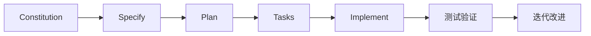

# 现代C++版Lua解释器项目

这是一个基于**规格驱动开发(Spec-Driven Development)**方法构建的现代C++版Lua 5.1.5解释器项目。

## 项目目标

基于参考项目 `lua_c_analysis`（Lua 5.1.5中文注释版）和 `lua_with_cpp`（C++版Lua解释器半成品），构建一个：

- 🎯 **完全兼容** Lua 5.1.5语法和语义的解释器
- 🚀 **现代化** 充分利用C++17/20特性的实现
- ⚡ **高性能** 优化的虚拟机和内存管理
- 🏗️ **模块化** 易于维护和扩展的架构设计
- 🧪 **可靠** 全面测试覆盖的企业级质量

## 开发方法

本项目采用Spec-Kit的规格驱动开发方法，通过以下命令进行结构化开发：

### 核心命令

1. **`/constitution`** - 建立项目治理原则和开发指导方针
2. **`/specify`** - 创建详细的功能规格说明
3. **`/plan`** - 生成技术实现计划和架构设计
4. **`/tasks`** - 从计划中分解出可执行的开发任务
5. **`/implement`** - 执行任务并构建完整解释器

### 开发流程



## 参考项目

- **lua_c_analysis**: 提供Lua 5.1.5的深度技术文档和实现细节
- **lua_with_cpp**: 提供现有的C++架构基础和部分功能实现
- **spec-kit**: 提供规格驱动开发的方法论和工具支持

## 快速开始

1. 确保已安装必要的开发工具（C++17编译器、CMake、Git等）
2. 执行 `/constitution` 建立项目基础原则
3. 使用 `/specify` 定义具体的功能需求
4. 通过 `/plan` 制定技术实现方案
5. 运行 `/tasks` 生成开发任务列表
6. 执行 `/implement` 开始实际开发

## 项目结构

```
lua_cpp/
├── memory/           # 项目宪法和核心原则
├── specs/           # 功能规格和实现计划
├── scripts/         # 开发辅助脚本
├── .claude/         # Claude AI助手命令配置
└── templates/       # 文档模板
```

## 许可证

MIT License - 继承自原始Lua项目的开源精神

---

*本项目使用Spec-Kit方法论进行规格驱动开发*