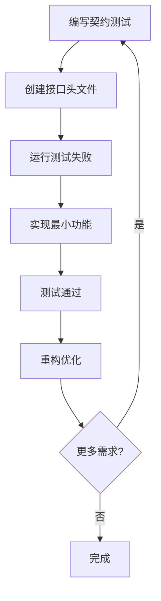

# 现代C++版Lua 5.1.5解释器

这是一个基于**测试驱动开发(TDD)**方法构建的现代C++版Lua 5.1.5解释器项目。

## 🎯 项目目标

基于参考项目 `lua_c_analysis`（Lua 5.1.5中文注释版）和 `lua_with_cpp`（C++版Lua解释器半成品），构建一个：

- ✅ **完全兼容** Lua 5.1.5语法和语义的解释器
- 🚀 **现代化** 充分利用C++17/20特性的实现
- ⚡ **高性能** 优化的虚拟机和内存管理
- 🏗️ **模块化** 易于维护和扩展的架构设计
- 🧪 **可靠** 全面测试覆盖的企业级质量

## 📋 开发状态

### ✅ 已完成 - TDD接口设计阶段

基于契约测试创建了完整的头文件接口系统：

- **AST系统** (`src/parser/ast.h`) - 完整的抽象语法树节点层次结构
- **解析器** (`src/parser/parser.h`) - 词法分析和语法分析接口
- **字节码** (`src/compiler/bytecode.h`) - Lua 5.1.5兼容的字节码格式
- **编译器** (`src/compiler/compiler.h`) - AST到字节码的编译接口
- **虚拟机** (`src/vm/`) - 栈管理、调用帧、执行引擎
- **内存管理** (`src/memory/garbage_collector.h`) - 增量垃圾回收系统
- **C API** (`src/api/`) - 完整的Lua 5.1.5 C API接口

### 🔄 进行中 - 实现阶段

下一步将基于已定义的接口进行具体实现。

## 🛠️ 开发方法

本项目采用**测试驱动开发(TDD)**方法：

### 核心原则

1. **契约优先** - 先定义契约测试，明确组件行为
2. **接口设计** - 基于契约测试创建头文件接口
3. **实现开发** - 实现接口以满足契约测试
4. **重构改进** - 在测试保护下持续优化

### TDD开发流程



## 🏗️ 架构设计

### 核心组件

```
lua_cpp/
├── src/
│   ├── core/                 # 核心类型和工具
│   │   ├── common.h         # 通用定义
│   │   ├── lua_value.h      # Lua值系统
│   │   └── error.h          # 错误处理
│   ├── parser/              # 解析器组件
│   │   ├── ast.h           # 抽象语法树
│   │   └── parser.h        # 解析器接口
│   ├── compiler/            # 编译器组件
│   │   ├── bytecode.h      # 字节码格式
│   │   └── compiler.h      # 编译器接口
│   ├── vm/                  # 虚拟机组件
│   │   ├── stack.h         # 栈管理
│   │   ├── call_frame.h    # 调用帧
│   │   └── virtual_machine.h # VM引擎
│   ├── memory/              # 内存管理
│   │   └── garbage_collector.h # 垃圾回收器
│   └── api/                 # C API接口
│       ├── lua_api.h       # 主API接口
│       └── luaaux.h        # 辅助库接口
├── tests/
│   └── contract/           # 契约测试
├── benchmarks/             # 性能测试
└── docs/                   # 项目文档
```

### 设计特点

- **现代C++** - 使用C++17/20特性（智能指针、RAII、模板等）
- **类型安全** - 强类型系统避免C风格的类型转换
- **异常安全** - 使用RAII和智能指针确保资源安全
- **模块化** - 清晰的组件边界和依赖关系
- **可测试** - 接口设计便于单元测试和集成测试

## 🚀 快速开始

### 环境要求

- C++17或更高版本的编译器（GCC 7+, Clang 6+, MSVC 2019+）
- CMake 3.16+
- Git

### 构建步骤

```bash
# 克隆项目
git clone <repository-url>
cd lua_cpp

# 创建构建目录
mkdir build && cd build

# 配置构建
cmake .. -DCMAKE_BUILD_TYPE=Release

# 编译
cmake --build . --parallel

# 运行测试
ctest --output-on-failure
```

### 构建选项

```bash
# 启用调试模式
cmake .. -DCMAKE_BUILD_TYPE=Debug

# 启用代码覆盖率
cmake .. -DENABLE_COVERAGE=ON

# 禁用测试构建
cmake .. -DBUILD_TESTING=OFF

# 启用性能基准测试
cmake .. -DBUILD_BENCHMARKS=ON

# 严格Lua 5.1.5兼容模式
cmake .. -DLUA_CPP_STRICT_COMPATIBILITY=ON
```

## 📊 开发进度

| 组件 | 状态 | 进度 | 说明 |
|------|------|------|------|
| 核心类型 | ✅ 完成 | 100% | 基础数据结构和错误处理 |
| AST系统 | ✅ 完成 | 100% | 抽象语法树节点层次结构 |
| 解析器 | ✅ 完成 | 100% | 词法和语法分析接口 |
| 字节码 | ✅ 完成 | 100% | Lua 5.1.5字节码格式 |
| 编译器 | ✅ 完成 | 100% | AST到字节码编译接口 |
| 虚拟机 | ✅ 完成 | 100% | 栈、调用帧、执行引擎接口 |
| 内存管理 | ✅ 完成 | 100% | 垃圾回收器接口 |
| C API | ✅ 完成 | 100% | 完整Lua 5.1.5 API接口 |
| **实现阶段** | 🔄 进行中 | 0% | 基于接口的具体实现 |

## 🧪 测试策略

### 测试层次

1. **契约测试** - 定义组件行为规范
2. **单元测试** - 测试单个类和函数
3. **集成测试** - 测试组件间交互
4. **兼容性测试** - 确保Lua 5.1.5兼容性
5. **性能测试** - 基准测试和性能回归检查

### 测试覆盖目标

- 代码覆盖率 > 95%
- 分支覆盖率 > 90%
- 100% Lua 5.1.5官方测试套件通过

## 📚 技术文档

- [API参考文档](docs/api/) - C++接口文档
- [架构设计文档](docs/architecture/) - 系统架构说明
- [开发指南](docs/development/) - 开发流程和规范
- [性能分析报告](docs/performance/) - 性能测试结果

## 🤝 贡献指南

1. Fork项目并创建特性分支
2. 遵循TDD开发流程
3. 确保所有测试通过
4. 提交Pull Request

### 代码规范

- 使用C++17/20现代特性
- 遵循RAII原则
- 保持接口简洁明确
- 编写充分的文档和测试

## 📝 参考项目

- **lua_c_analysis** - 提供Lua 5.1.5的深度技术分析
- **lua_with_cpp** - 提供现有的C++架构基础
- **Lua 5.1.5** - 官方参考实现

## 📄 许可证

MIT License - 继承自原始Lua项目的开源精神

---

*本项目使用测试驱动开发(TDD)方法构建高质量的Lua 5.1.5解释器*