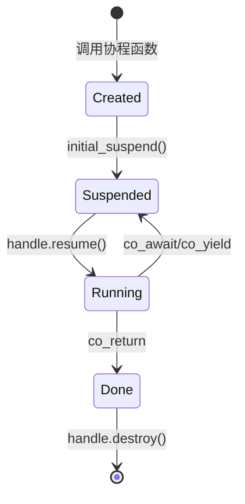

# C++20协程技术参考 - 用于Lua协程实现

**文档目的**: 为T028协程标准库实现提供C++20协程技术参考  
**创建日期**: 2025-10-11  

---

## 📚 一、C++20协程核心概念

### 1.1 协程三要素

C++20协程基于三个核心组件：

```cpp
// 1. 协程函数 - 包含co_await/co_yield/co_return的函数
Task MyCoroutine() {
    co_await SomeAwaitable();  // 挂起点
    co_yield Value();          // 产生值并挂起
    co_return Result();        // 返回并结束
}

// 2. Promise Type - 定义协程行为
struct Task {
    struct promise_type {
        Task get_return_object();
        std::suspend_always initial_suspend() noexcept;
        std::suspend_always final_suspend() noexcept;
        void return_void();
        void unhandled_exception();
    };
};

// 3. Awaitable - 控制挂起和恢复
struct Awaitable {
    bool await_ready() noexcept;
    void await_suspend(std::coroutine_handle<>) noexcept;
    void await_resume() noexcept;
};
```

### 1.2 协程生命周期



---

## 🎯 二、Lua协程到C++20协程的映射

### 2.1 概念映射表

| Lua概念 | C++20协程 | 实现方式 |
|---------|-----------|----------|
| `coroutine.create(f)` | 创建协程 | 调用协程函数，获取`coroutine_handle` |
| `coroutine.resume(co)` | 恢复执行 | `handle.resume()` |
| `coroutine.yield(...)` | 挂起协程 | `co_yield values` |
| `coroutine.status(co)` | 查询状态 | 检查`handle.done()`和`promise.state_` |
| 协程函数 | 协程函数 | 返回类型有`promise_type`的函数 |
| 协程对象 | `coroutine_handle` | 管理协程状态的句柄 |

### 2.2 状态映射

```cpp
enum class CoroutineState {
    SUSPENDED,  // Lua: "suspended" - 可以resume
    RUNNING,    // Lua: "running"   - 正在执行
    NORMAL,     // Lua: "normal"    - 调用了其他协程
    DEAD        // Lua: "dead"      - 已结束
};

// C++20协程状态判断
CoroutineState GetState(std::coroutine_handle<promise_type> handle) {
    if (!handle || handle.done()) {
        return CoroutineState::DEAD;
    }
    return handle.promise().state_;
}
```

---

## 💻 三、关键实现模式

### 3.1 Promise Type模式

#### 完整Promise Type实现

```cpp
struct LuaCoroutinePromise {
    /* ============================================================ */
    /* 必需接口 */
    /* ============================================================ */
    
    // 1. 返回协程对象
    LuaCoroutine get_return_object() {
        return LuaCoroutine{
            std::coroutine_handle<LuaCoroutinePromise>::from_promise(*this)
        };
    }
    
    // 2. 初始挂起策略
    std::suspend_always initial_suspend() noexcept {
        state_ = CoroutineState::SUSPENDED;
        return {};  // 总是初始挂起（Lua语义）
    }
    
    // 3. 最终挂起策略
    std::suspend_always final_suspend() noexcept {
        state_ = CoroutineState::DEAD;
        return {};  // 总是最终挂起，不自动销毁
    }
    
    // 4. 返回void
    void return_void() {
        state_ = CoroutineState::DEAD;
    }
    
    // 5. 异常处理
    void unhandled_exception() {
        exception_ = std::current_exception();
        state_ = CoroutineState::DEAD;
    }
    
    /* ============================================================ */
    /* 可选接口 - Yield支持 */
    /* ============================================================ */
    
    // 支持co_yield语法
    auto yield_value(std::vector<LuaValue> values) {
        yield_values_ = std::move(values);
        state_ = CoroutineState::SUSPENDED;
        
        // 返回一个awaitable，控制如何挂起
        struct YieldAwaiter {
            bool await_ready() const noexcept { return false; }
            
            void await_suspend(std::coroutine_handle<LuaCoroutinePromise> h) noexcept {
                // 这里可以记录挂起信息
            }
            
            std::vector<LuaValue> await_resume() noexcept {
                // 返回resume传入的参数
                return {};
            }
        };
        
        return YieldAwaiter{};
    }
    
    /* ============================================================ */
    /* 自定义数据成员 */
    /* ============================================================ */
    
    CoroutineState state_ = CoroutineState::SUSPENDED;
    std::vector<LuaValue> yield_values_;
    std::vector<LuaValue> resume_values_;
    std::exception_ptr exception_;
    
    // 统计信息
    size_t resume_count_ = 0;
    size_t yield_count_ = 0;
};
```

### 3.2 协程对象模式

```cpp
class LuaCoroutine {
public:
    /* ============================================================ */
    /* Promise Type声明 */
    /* ============================================================ */
    using promise_type = LuaCoroutinePromise;
    
    /* ============================================================ */
    /* 构造和析构 */
    /* ============================================================ */
    
    explicit LuaCoroutine(std::coroutine_handle<promise_type> handle)
        : handle_(handle) {}
    
    ~LuaCoroutine() {
        if (handle_) {
            handle_.destroy();  // 销毁协程帧
        }
    }
    
    // 禁用拷贝（协程句柄不可拷贝）
    LuaCoroutine(const LuaCoroutine&) = delete;
    LuaCoroutine& operator=(const LuaCoroutine&) = delete;
    
    // 允许移动
    LuaCoroutine(LuaCoroutine&& other) noexcept
        : handle_(std::exchange(other.handle_, nullptr)) {}
    
    LuaCoroutine& operator=(LuaCoroutine&& other) noexcept {
        if (this != &other) {
            if (handle_) handle_.destroy();
            handle_ = std::exchange(other.handle_, nullptr);
        }
        return *this;
    }
    
    /* ============================================================ */
    /* 协程操作 */
    /* ============================================================ */
    
    // Resume操作
    std::vector<LuaValue> Resume(const std::vector<LuaValue>& args) {
        if (!handle_ || handle_.done()) {
            throw CoroutineStateError("Cannot resume finished coroutine");
        }
        
        // 设置resume参数
        handle_.promise().resume_values_ = args;
        handle_.promise().state_ = CoroutineState::RUNNING;
        handle_.promise().resume_count_++;
        
        // 恢复执行
        handle_.resume();
        
        // 检查异常
        if (handle_.promise().exception_) {
            std::rethrow_exception(handle_.promise().exception_);
        }
        
        // 返回yield值或空
        return std::move(handle_.promise().yield_values_);
    }
    
    // 查询状态
    CoroutineState GetState() const {
        if (!handle_) return CoroutineState::DEAD;
        if (handle_.done()) return CoroutineState::DEAD;
        return handle_.promise().state_;
    }
    
    // 检查是否完成
    bool IsDone() const {
        return !handle_ || handle_.done();
    }
    
    // 获取句柄（高级用法）
    std::coroutine_handle<promise_type> GetHandle() const {
        return handle_;
    }

private:
    std::coroutine_handle<promise_type> handle_;
};
```

### 3.3 协程函数模式

#### 方式1: Generator模式（适合简单yield）

```cpp
// 生成器协程 - 用于简单的值产生
LuaCoroutine SimpleGenerator() {
    co_yield std::vector<LuaValue>{LuaValue(1.0)};
    co_yield std::vector<LuaValue>{LuaValue(2.0)};
    co_yield std::vector<LuaValue>{LuaValue(3.0)};
    co_return;
}

// 使用方式
auto gen = SimpleGenerator();
auto v1 = gen.Resume({});  // {1.0}
auto v2 = gen.Resume({});  // {2.0}
auto v3 = gen.Resume({});  // {3.0}
```

#### 方式2: Task模式（适合复杂逻辑）

```cpp
// 任务协程 - 执行Lua函数
LuaCoroutine ExecuteLuaFunction(
    EnhancedVirtualMachine* vm,
    const LuaValue& func,
    std::vector<LuaValue> initial_args
) {
    try {
        // 设置执行环境
        auto& promise = co_await GetCurrentPromise();
        
        // 第一次resume获取参数
        auto args = promise.resume_values_.empty() 
                  ? initial_args 
                  : promise.resume_values_;
        
        // 执行Lua函数
        while (true) {
            auto result = vm->ExecuteFunction(func, args);
            
            // 检查是否需要yield
            if (vm->ShouldYield()) {
                // Yield并等待下次resume
                args = co_yield vm->GetYieldValues();
            } else {
                // 函数执行完毕
                co_return;
            }
        }
    } catch (const std::exception& e) {
        // 异常处理
        throw CoroutineError(std::string("Coroutine error: ") + e.what());
    }
}
```

#### 方式3: 嵌套协程模式

```cpp
// 外层协程
LuaCoroutine OuterCoroutine() {
    // 创建内层协程
    auto inner = InnerCoroutine();
    
    // 执行内层协程
    while (!inner.IsDone()) {
        auto result = inner.Resume({});
        
        // 将内层结果yield出去
        co_yield result;
    }
    
    co_return;
}

// 内层协程
LuaCoroutine InnerCoroutine() {
    co_yield std::vector<LuaValue>{LuaValue("inner1")};
    co_yield std::vector<LuaValue>{LuaValue("inner2")};
    co_return;
}
```

---

## 🔧 四、高级技巧

### 4.1 自定义Awaiter

```cpp
// 自定义awaiter - 控制挂起和恢复行为
template<typename T>
struct CustomAwaiter {
    T value_;
    
    // 是否准备好（true = 不挂起，false = 挂起）
    bool await_ready() const noexcept {
        // 例如：检查某个条件
        return SomeCondition();
    }
    
    // 挂起时的行为
    void await_suspend(std::coroutine_handle<> h) noexcept {
        // 例如：将句柄加入调度队列
        scheduler.Enqueue(h);
    }
    
    // 恢复时的返回值
    T await_resume() noexcept {
        return std::move(value_);
    }
};

// 使用自定义awaiter
LuaCoroutine UseCustomAwaiter() {
    auto result = co_await CustomAwaiter<int>{42};
    // result == 42
    co_return;
}
```

### 4.2 协程参数传递

```cpp
// Promise中添加参数支持
struct ParameterizedPromise {
    template<typename... Args>
    void set_parameters(Args&&... args) {
        parameters_ = std::make_tuple(std::forward<Args>(args)...);
    }
    
    auto get_parameters() {
        return parameters_;
    }
    
private:
    std::tuple<...> parameters_;
};

// 协程函数接收参数
LuaCoroutine CoroutineWithArgs(int a, double b, std::string c) {
    // 参数自动存储在promise中
    co_yield std::vector<LuaValue>{
        LuaValue(static_cast<double>(a)),
        LuaValue(b),
        LuaValue(c)
    };
    co_return;
}
```

### 4.3 异常安全

```cpp
// RAII守卫确保异常安全
class CoroutineGuard {
    std::coroutine_handle<> handle_;
    
public:
    explicit CoroutineGuard(std::coroutine_handle<> h) : handle_(h) {}
    
    ~CoroutineGuard() {
        if (handle_) {
            handle_.destroy();
        }
    }
    
    // 禁用拷贝
    CoroutineGuard(const CoroutineGuard&) = delete;
    CoroutineGuard& operator=(const CoroutineGuard&) = delete;
    
    // 允许移动
    CoroutineGuard(CoroutineGuard&& other) noexcept
        : handle_(std::exchange(other.handle_, nullptr)) {}
};

// 使用守卫
void SafeCoroutineUsage() {
    auto coro = MyCoroutine();
    CoroutineGuard guard(coro.GetHandle());
    
    // 即使抛出异常，协程也会被正确销毁
    coro.Resume({});
}
```

### 4.4 协程池化

```cpp
// 协程对象池 - 避免频繁分配
template<typename CoroutineType>
class CoroutinePool {
    std::vector<std::unique_ptr<CoroutineType>> pool_;
    size_t max_size_;
    
public:
    explicit CoroutinePool(size_t max_size = 100)
        : max_size_(max_size) {}
    
    CoroutineType* Acquire() {
        if (!pool_.empty()) {
            auto coro = std::move(pool_.back());
            pool_.pop_back();
            return coro.release();
        }
        return new CoroutineType();
    }
    
    void Release(CoroutineType* coro) {
        if (pool_.size() < max_size_) {
            coro->Reset();  // 重置状态
            pool_.emplace_back(coro);
        } else {
            delete coro;
        }
    }
};

// 使用池
static CoroutinePool<LuaCoroutine> g_pool;

LuaCoroutine* CreatePooledCoroutine() {
    return g_pool.Acquire();
}

void DestroyPooledCoroutine(LuaCoroutine* coro) {
    g_pool.Release(coro);
}
```

---

## ⚡ 五、性能优化

### 5.1 零成本抽象验证

```cpp
// 编译器优化验证
// 使用 -O3 -DNDEBUG 编译，查看汇编代码

// 内联协程函数
[[gnu::always_inline, msvc::forceinline]]
inline void ResumeCoroutine(std::coroutine_handle<> h) {
    h.resume();
}

// Constexpr协程检查
constexpr bool IsCoroutineDone(std::coroutine_handle<> h) {
    return h.done();
}

// 查看生成的汇编
// g++ -S -O3 -std=c++20 coroutine.cpp
// 应该看到直接的跳转指令，无额外开销
```

### 5.2 内存布局优化

```cpp
// 协程帧内存优化
struct OptimizedPromise {
    // 1. 按访问频率排序成员
    CoroutineState state_;          // 最常访问
    std::vector<LuaValue> values_;  // 次常访问
    std::exception_ptr exception_;  // 少访问
    
    // 2. 使用缓存对齐
    alignas(64) char padding_[64];
    
    // 3. 预分配常用大小
    static constexpr size_t SMALL_VECTOR_SIZE = 4;
    std::array<LuaValue, SMALL_VECTOR_SIZE> small_values_;
};

// 自定义分配器
struct CoroutineAllocator {
    void* allocate(size_t size) {
        // 使用内存池
        return memory_pool_.allocate(size);
    }
    
    void deallocate(void* ptr, size_t size) {
        memory_pool_.deallocate(ptr, size);
    }
};
```

### 5.3 编译器提示

```cpp
// 使用编译器提示优化分支预测
LuaCoroutine OptimizedCoroutine() {
    if ([[likely]] NormalPath()) {
        co_yield Value1();
    } else [[unlikely]] {
        co_yield Value2();
    }
    
    co_return;
}

// 标记为热路径
[[gnu::hot]]
void HotCoroutinePath() {
    // 编译器会更积极地优化这个函数
}

// 标记为冷路径
[[gnu::cold]]
void ColdCoroutineError() {
    // 编译器会将这个代码移到远处
}
```

---

## 🐛 六、调试技巧

### 6.1 协程状态打印

```cpp
// 添加调试信息
struct DebugPromise {
    DebugPromise() {
        std::cout << "Coroutine created\n";
    }
    
    ~DebugPromise() {
        std::cout << "Coroutine destroyed\n";
    }
    
    std::suspend_always initial_suspend() noexcept {
        std::cout << "Initial suspend\n";
        return {};
    }
    
    std::suspend_always final_suspend() noexcept {
        std::cout << "Final suspend\n";
        return {};
    }
    
    void return_void() {
        std::cout << "Return void\n";
    }
};
```

### 6.2 GDB调试

```bash
# GDB协程支持
gdb ./your_program

# 加载libstdc++协程支持
(gdb) py import libstdcxx.v6.printers

# 打印协程句柄
(gdb) print handle

# 查看promise对象
(gdb) print handle.promise()

# 检查协程是否完成
(gdb) print handle.done()
```

### 6.3 AddressSanitizer

```cmake
# CMakeLists.txt
if(CMAKE_BUILD_TYPE MATCHES Debug)
    add_compile_options(-fsanitize=address)
    add_link_options(-fsanitize=address)
endif()
```

```bash
# 运行带ASan的测试
ASAN_OPTIONS=detect_leaks=1 ./test_coroutine
```

---

## 📊 七、基准测试

### 7.1 微基准测试

```cpp
#include <benchmark/benchmark.h>

// 协程创建开销
static void BM_CoroutineCreation(benchmark::State& state) {
    for (auto _ : state) {
        auto coro = SimpleCoroutine();
        benchmark::DoNotOptimize(coro);
    }
}
BENCHMARK(BM_CoroutineCreation);

// Resume/Yield开销
static void BM_ResumeYield(benchmark::State& state) {
    auto coro = YieldingCoroutine();
    for (auto _ : state) {
        coro.Resume({});
    }
}
BENCHMARK(BM_ResumeYield);

// 与函数调用对比
static void BM_FunctionCall(benchmark::State& state) {
    for (auto _ : state) {
        NormalFunction();
        benchmark::DoNotOptimize(result);
    }
}
BENCHMARK(BM_FunctionCall);
```

### 7.2 性能分析

```bash
# 使用perf分析
perf record -g ./test_coroutine
perf report

# 使用Valgrind Callgrind
valgrind --tool=callgrind ./test_coroutine
kcachegrind callgrind.out.*
```

---

## 🎓 八、最佳实践

### 8.1 Do's ✅

1. **总是使用RAII管理协程生命周期**
   ```cpp
   auto coro = MyCoroutine();
   // 自动销毁
   ```

2. **使用移动语义避免拷贝**
   ```cpp
   LuaCoroutine coro = std::move(CreateCoroutine());
   ```

3. **在promise中缓存常用数据**
   ```cpp
   struct promise_type {
       std::vector<LuaValue> cached_values_;
   };
   ```

4. **使用异常处理机制**
   ```cpp
   void unhandled_exception() {
       exception_ = std::current_exception();
   }
   ```

### 8.2 Don'ts ❌

1. **不要手动delete协程句柄**
   ```cpp
   // ❌ 错误
   delete handle.address();
   
   // ✅ 正确
   handle.destroy();
   ```

2. **不要在协程外部访问promise**
   ```cpp
   // ❌ 危险
   auto& promise = handle.promise();
   // promise可能已被销毁
   ```

3. **不要忘记检查handle有效性**
   ```cpp
   // ❌ 危险
   handle.resume();
   
   // ✅ 安全
   if (handle && !handle.done()) {
       handle.resume();
   }
   ```

4. **不要在协程中使用thread_local**
   ```cpp
   // ❌ 可能导致问题
   thread_local int value;
   ```

---

## 📚 九、参考资源

### C++标准文档
- [C++20 Coroutines - N4861](http://www.open-std.org/jtc1/sc22/wg21/docs/papers/2020/n4861.pdf)
- [cppreference - Coroutines](https://en.cppreference.com/w/cpp/language/coroutines)

### 教程和博客
- [Lewis Baker - Coroutine Theory](https://lewissbaker.github.io/)
- [Asymmetric Transfer - Coroutines](https://lewissbaker.github.io/2017/09/25/coroutine-theory)
- [Modernes C++ - Coroutines](https://www.modernescpp.com/index.php/c-20-coroutines)

### 实现参考
- [cppcoro库](https://github.com/lewissbaker/cppcoro)
- [folly协程](https://github.com/facebook/folly/tree/main/folly/experimental/coro)

---

**文档版本**: 1.0  
**最后更新**: 2025-10-11  
**适用项目**: lua_cpp T028协程标准库
